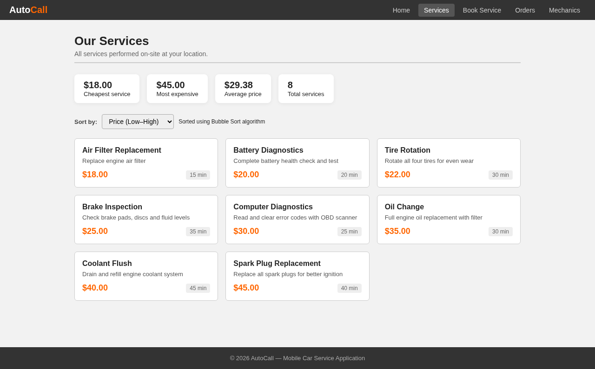
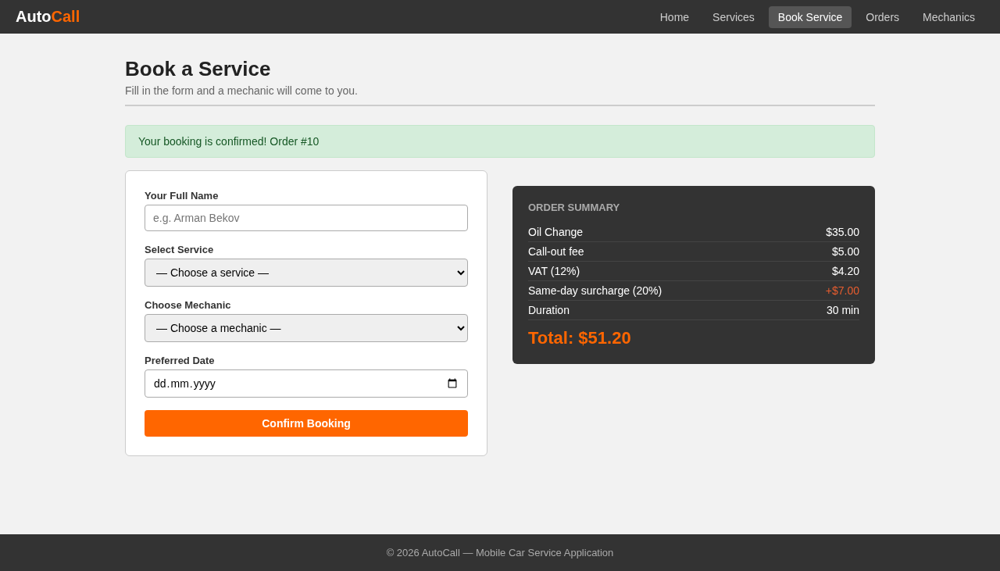
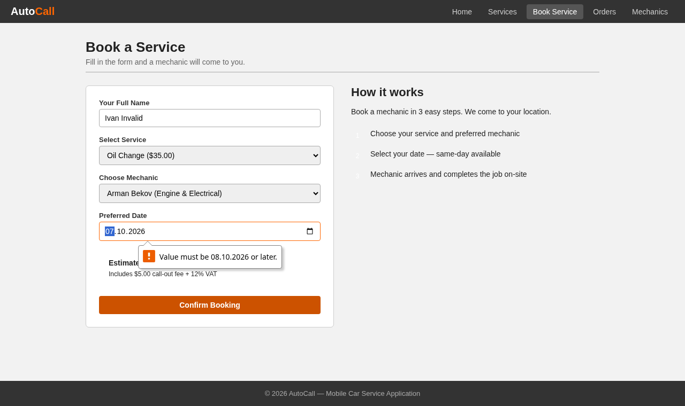
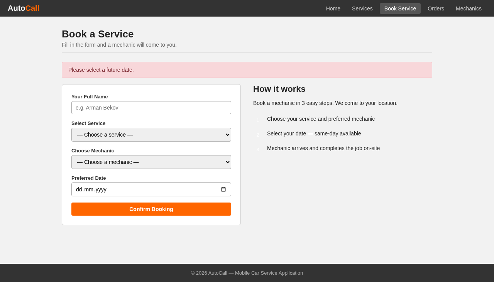
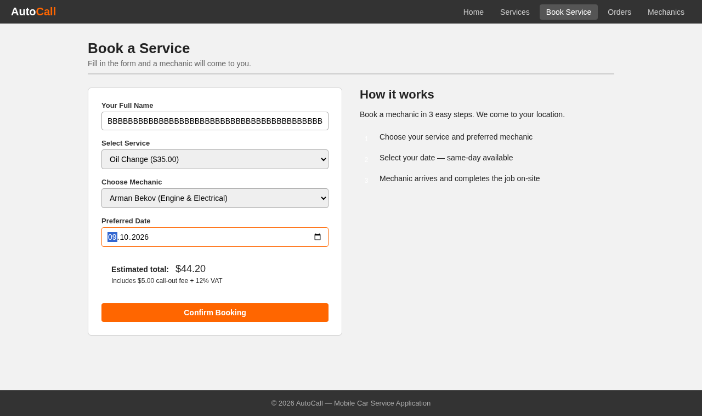
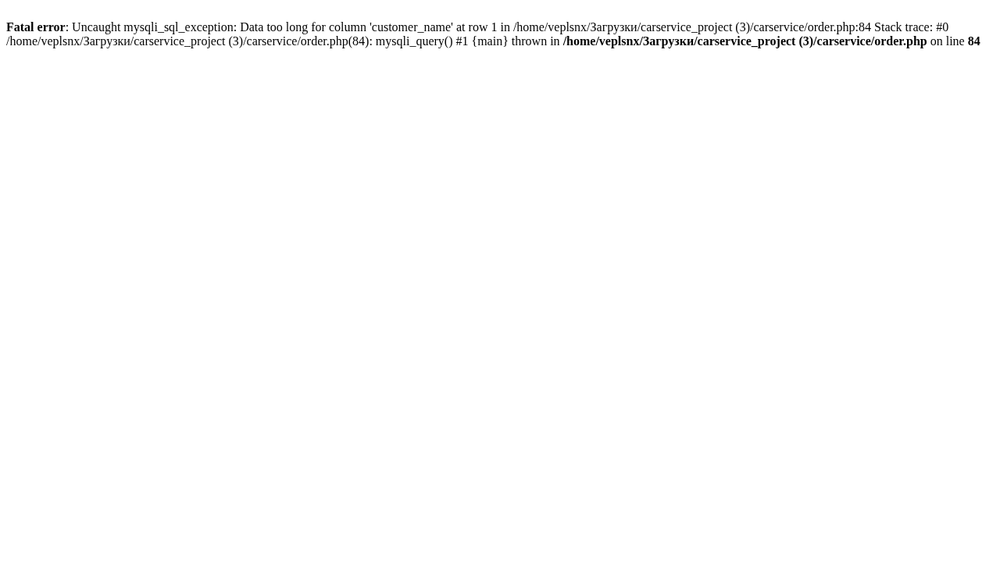
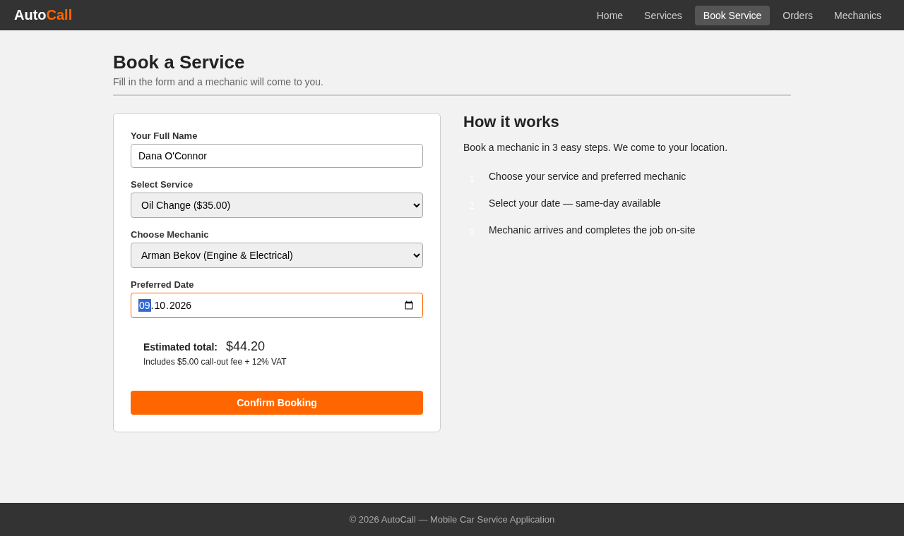
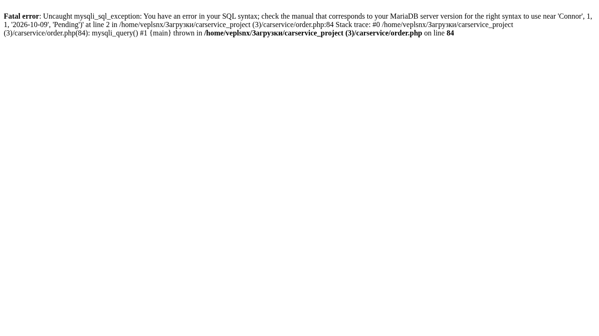
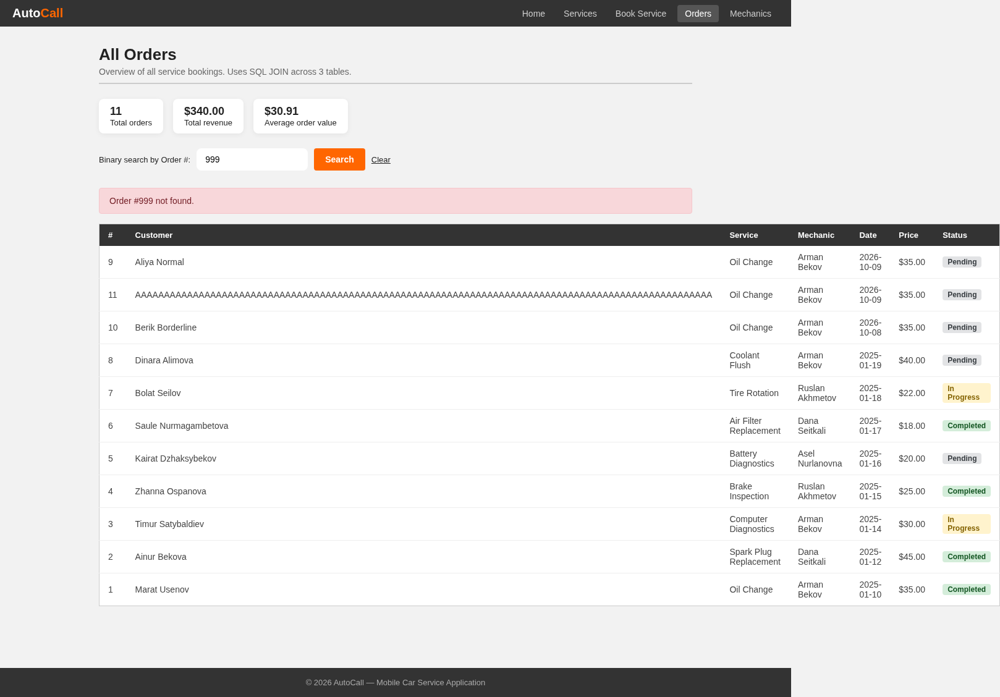

# AutoCall: разбор всех тестов (шпаргалка для защиты)

Этот документ объясняет каждый из 10 тестов проекта AutoCall: что проверяется, как, какие данные, что получили и почему. Если на защите спросят «что здесь происходит», ответ найдётся здесь.

Итог: **7 тестов PASS, 3 теста FAIL** (тесты 7, 8, 9). Все три FAIL показывают реальные ошибки в коде приложения.

## 1. Что тестируем

AutoCall: сайт для заказа выездного ремонта машины на PHP и MySQL. Пять страниц:

| Страница | Что делает |
|---|---|
| `index.php` | Главная: сколько услуг, механиков и выполненных заказов |
| `services.php` | Список услуг, сортировка (пузырьком) по названию, цене, времени; минимальная, максимальная и средняя цена |
| `order.php` | Форма заказа: имя, услуга, механик, дата. Считает цену |
| `orders.php` | Все заказы, суммы, поиск заказа по номеру (бинарный поиск) |
| `mechanics.php` | Механики: сколько заказов, сколько заработали, рейтинг |

Тесты покрывают три функции, где пользователь вводит данные или приложение считает: страницу услуг, форму заказа и поиск заказа.

**Как считается цена заказа** (`order.php`, строки 57–78):

- цена услуги + выезд 5,00 $ + НДС 12% от цены услуги;
- если дата заказа сегодня, ещё +20% от цены услуги (срочность).

Пример: Oil Change стоит 35,00 $. НДС = 35 × 0,12 = 4,20 $. Итого 35 + 5 + 4,20 = **44,20 $**. Если заказ на сегодня: +35 × 0,20 = 7,00 $, итого **51,20 $**.

**База данных** `car_service_db`: три таблицы (`services`, `mechanics`, `orders`) и тестовые данные: 8 услуг (от 18 до 45 $, сумма 235 $), 4 механика, 8 заказов.

## 2. Теория, которую нужно знать

### Типы тестовых данных

| Тип | Что это | Что должна сделать программа | Пример в нашем проекте |
|---|---|---|---|
| **Нормальные** (normal) | Данные, которые обычно вводят | Работает без ошибок | Имя `Aliya Normal`, дата завтра |
| **Граничные** (borderline, extreme) | Самое крайнее значение, которое программа ещё **принимает** | Тоже работает без ошибок | Дата «сегодня», имя из 100 символов, заказ №1 |
| **Недопустимые** (invalid) | Данные, которые программа должна **отклонить** | Показать сообщение об ошибке, не упасть | Дата «вчера», имя из пробелов, имя из 101 символа, заказ №999 |

Главное отличие: граничное значение **принимается**, недопустимое **отклоняется**. Значение на один шаг за границей (101 символ при максимуме 100) уже недопустимое.

В наших тестах: нормальные 1, 2, 8; граничные 3, 6, 9; недопустимые 4, 5, 7, 10.

### Типы валидации (проверки данных)

Валидация это проверка данных программой до того, как она их использует. В тестах проверяются такие виды:

| Вид валидации | Что проверяет | Где в AutoCall | Тесты |
|---|---|---|---|
| Проверка диапазона (range check) | Значение в допустимых пределах | Дата заказа: сегодня или позже (`order.php`, строки 68–75; атрибут `min` у поля даты) | 3, 4 |
| Проверка присутствия (presence check) | Обязательное значение введено | Имя не должно быть пустым (`order.php`, строка 38) | 5 |
| Проверка длины (length check) | Текст не длиннее допустимого | Колонка имени вмещает 100 символов (`database.sql`) | 6, 7 |
| Проверка существования (lookup check) | Запись существует | Поиск заказа находит заказ или пишет «not found» (`orders.php`, строки 57–71) | 9, 10 |
| Проверка спецсимволов | Апостроф и подобные символы не ломают программу | Имя попадает в базу (`order.php`, строки 81–84) | 8 |
| Проверка расчёта (calculation check) | Вычисленное значение верно | Цена, НДС, надбавка, среднее, порядок сортировки | 1, 2, 3 |

### Два вида тестирования, которые использовались

**1. Чёрный ящик (black box), все 10 тестов.** Тестировщик не смотрит в код. Он работает со страницами как клиент: вводит данные, нажимает кнопки и сравнивает то, что видит, с ожидаемым. Плюс: не нужно знать код, быстро. Минус: если тест провалился, непонятно **почему**. Тесты 7, 8, 9 провалились, и по странице причину не понять.

**2. Белый ящик (white box), для поиска причин трёх FAIL.** После провалов я прочитал код и нашёл точные строки, проследив путь данных вручную:

- тест 9: `$sorted[$mid]['order_id'] === $search_id`. MySQL отдаёт номер заказа как текст `"1"`, а из формы приходит число `1`. Строгое сравнение их не приравнивает;
- тест 8: имя вставляется прямо в SQL-команду (`order.php`, строка 81), апостроф заканчивает текст раньше времени;
- тест 7: перед вставкой (строка 84) нет проверки длины.

Честно: белый ящик здесь ограничился этим разбором. Полного тестирования белым ящиком с трассировочными таблицами по всем веткам кода в проекте нет, оно заняло бы намного больше времени.

### Как читать PASS и FAIL

- **PASS**: фактический результат совпал с ожидаемым.
- **FAIL**: не совпал. Это находка: ошибка в приложении.

## 3. Как проводились тесты

- Сервер: встроенный сервер PHP (`php -S localhost:8081 -d display_errors=1`), база MySQL, браузер Chromium. Настройка `display_errors=1` включена по умолчанию в XAMPP, поэтому при сбое страница показывает текст ошибки PHP.
- Playwright (инструмент автоматизации браузера) сам открывал страницы, вводил данные, нажимал кнопки и делал скриншоты. Файл с тестами: `playwright/tests/carservice.spec.ts`.
- Перед запуском база загружалась заново из `database.sql`, чтобы результат не зависел от прошлых запусков.
- Тесты не зависят друг от друга. Заказы из тестов 2, 3, 6 получили номера №9, №10, №11.
- Скриншоты лежат в папке `evidence/`.

**Почему в отчёте Playwright «10 passed», хотя 3 теста FAIL?** Тесты 7, 8, 9 помечены `test.fail`: это значит «мы знаем, что приложение здесь ошибается; тест считается успешным, пока ошибка повторяется». В отчёте Playwright это зелёная галочка. В нашей таблице результатов эти три теста честно записаны как FAIL.

**Почему в тесте 4 браузерную проверку отключали?** Поле даты имеет `min=сегодня`, и браузер сам не даёт отправить вчерашнюю дату. Нам нужно проверить ещё и сервер. Скрипт ставит форме `noValidate`, браузер перестаёт проверять, форма уходит на сервер. Код приложения при этом не менялся.

## 4. Разбор тестов

### Тест 1. Сортировка услуг по цене и статистика цен (нормальные данные)

- **Вид валидации:** проверка расчёта и порядка сортировки.
- **Что проверяем:** сортировка по цене работает, а минимальная, максимальная и средняя цена посчитаны верно.
- **Шаги:** открыть `/services.php`, выбрать «Price (Low–High)», прочитать порядок карточек и четыре блока статистики.
- **Данные:** параметр `sort=price`; цены в базе: 18, 20, 22, 25, 30, 35, 40, 45.
- **Ожидали:** карточки от 18,00 $ до 45,00 $; минимум 18,00 $, максимум 45,00 $, среднее 29,38 $, всего 8.
- **Получили:** ровно это. Адрес изменился на `services.php?sort=price`. **PASS.**
- **Откуда 29,38:** сумма цен 235, делим на 8 = 29,375. Функция `number_format` округляет до двух знаков: 29,38.
- **Что происходит в коде:** `services.php`, строки 26–49: сортировка пузырьком. Два цикла, соседние элементы меняются местами, если левый больше правого. Строки 52–62: сумма, `min()`, `max()`, среднее.
- **Скриншот:** `evidence/TC01_services_by_price.png`



### Тест 2. Заказ на завтра (нормальные данные)

- **Вид валидации:** проверка расчёта (цена + выезд + НДС).
- **Что проверяем:** обычный заказ сохраняется, цена считается верно.
- **Шаги:** открыть `/order.php`, ввести имя `Aliya Normal`, услуга Oil Change, механик Arman Bekov, дата завтра (`2026-10-09`), нажать «Confirm Booking».
- **Ожидали:** сообщение «Your booking is confirmed! Order #9» и справа «Order Summary» с итогом 44,20 $.
- **Получили:** ровно это: Oil Change 35,00; выезд 5,00; НДС 4,20; длительность 30 мин; Total 44,20. **PASS.**
- **Почему номер 9:** в базе уже 8 заказов, следующий номер даёт `AUTO_INCREMENT`.
- **Что происходит в коде:** `order.php`: проверки полей (строки 38–49), цена из базы (строка 52), расчёт (57–61), `INSERT` (81–84), сообщение с номером заказа (строка 85).
- **Скриншот:** `evidence/TC02_booking_tomorrow.png`


### Тест 3. Заказ на сегодня (граничные данные)

- **Вид валидации:** проверка диапазона (дата): самая ранняя разрешённая дата.
- **Что проверяем:** сегодняшняя дата принимается и даёт надбавку 20%.
- **Шаги:** то же, что в тесте 2, но имя `Berik Borderline`, дата сегодня (`2026-10-08`).
- **Почему это граничное значение:** программа отклоняет даты раньше сегодняшней, значит «сегодня» самое крайнее значение, которое она ещё принимает.
- **Ожидали:** заказ принят, в сводке строка «Same-day surcharge (20%) +$7.00», итог 51,20 $.
- **Получили:** «Order #10», надбавка +7,00 $, Total 51,20 $. **PASS.**
- **Что происходит в коде:** `order.php`, строки 68–71: если `$order_date === $today`, то `urgency_charge = цена × 0,20`. 35 × 0,20 = 7,00. Итог: 35 + 5 + 4,20 + 7 = 51,20.
- **Скриншот:** `evidence/TC03_booking_today.png`



### Тест 4. Заказ на вчера (недопустимые данные)

- **Вид валидации:** проверка диапазона (дата): даты раньше сегодня должны отклоняться и браузером, и сервером.
- **Что проверяем:** дата в прошлом отклоняется.
- **Шаги:** открыть форму, имя `Ivan Invalid`, Oil Change, Arman Bekov, дата вчера (`2026-10-07`), нажать «Confirm Booking». Браузер остановил форму. Затем скрипт отключил проверку браузера и форма ушла на сервер.
- **Ожидали:** сообщение «Please select a future date.», заказ не сохранён.
- **Получили:**
  1. Браузер показал подсказку «Value must be 08.10.2026 or later.» (скриншот `TC04_client_validation.png`);
  2. сервер показал «Please select a future date.», сводки заказа нет, заказ не сохранён. **PASS.**
- **Что происходит в коде:** два слоя защиты. Первый: в HTML у поля даты стоит `min="сегодня"` (`order.php`, строка 198). Второй: сервер, строки 72–75: `elseif ($order_date < $today)` ставит ошибку.
- **Зачем два слоя:** защита только в браузере ненадёжна, запрос можно отправить и без браузера. Сервер обязан проверять сам.
- **Скриншоты:** `evidence/TC04_client_validation.png`, `evidence/TC04_past_date_rejected.png`





### Тест 5. Имя из одних пробелов (недопустимые данные)

- **Вид валидации:** проверка присутствия (имя не должно быть пустым).
- **Что проверяем:** пустое имя не принимается, даже если выглядит «непустым».
- **Шаги:** в поле имени ввести 5 пробелов, выбрать услугу, механика, завтрашнюю дату, нажать «Confirm Booking».
- **Ожидали:** «Please enter your name.», заказ не сохранён.
- **Получили:** ровно это. **PASS.**
- **Что происходит в коде:** у поля стоит `required`, но браузер считает 5 пробелов заполненным полем и пропускает. Сервер делает `trim()` (`order.php`, строка 32), пробелы исчезают, остаётся пустая строка, и `empty()` (строка 38) даёт ошибку.
- **Побочное наблюдение:** `empty("0")` в PHP тоже истина, поэтому имя `0` сервер отклонил бы так же. Тестами не проверялось.
- **Скриншот:** `evidence/TC05_blank_name.png`


### Тест 6. Имя из 100 символов (граничные данные)

- **Вид валидации:** проверка длины (максимум 100 символов).
- **Что проверяем:** самое длинное имя, которое помещается в базу, принимается.
- **Шаги:** имя из 100 букв `A`, Oil Change, Arman Bekov, завтра, «Confirm Booking».
- **Почему 100:** колонка `customer_name` объявлена как `VARCHAR(100)` (`database.sql`). 100 символов это максимум.
- **Ожидали:** заказ принят, итог 44,20 $.
- **Получили:** «Your booking is confirmed! Order #11», Total 44,20 $. **PASS.**
- **Скриншот:** `evidence/TC06_name_100.png`


### Тест 7. Имя из 101 символа (недопустимые данные), FAIL

- **Вид валидации:** проверка длины (больше 100 символов должно отклоняться).
- **Что проверяем:** слишком длинное имя отклоняется с понятным сообщением.
- **Шаги:** имя из 101 буквы `B`, Oil Change, Arman Bekov, завтра, «Confirm Booking».
- **Ожидали:** сообщение об ошибке на странице заказа, заказ не сохранён.
- **Получили:** страница заказа заменилась страницей с сырой ошибкой PHP: «Fatal error: Uncaught mysqli_sql_exception: Data too long for column 'customer_name' at row 1 in …/order.php:84». Пользователь не получил понятного сообщения, а страница показала путь к файлу. Заказ не сохранился (проверка базы после тестов: 11 заказов, ни одного с этим именем). **FAIL.**
- **Что происходит в коде:** `order.php` вообще не проверяет длину имени (строки 38–49 проверяют только «не пусто»). База (в строгом режиме) отказывается вставить 101 символ в `VARCHAR(100)`. Современный PHP при ошибке запроса выбрасывает исключение. Его никто не ловит, страница обрывается и показывает ошибку.
- **Как исправить:** проверить `strlen($customer_name) > 100` до вставки и показать сообщение; добавить `maxlength="100"` в поле.
- **Скриншоты:** `evidence/TC07_form_filled.png` (форма до отправки), `evidence/TC07_name_101.png` (результат)





### Тест 8. Имя с апострофом (нормальные данные), FAIL

- **Вид валидации:** проверка спецсимволов (программа должна уметь обрабатывать апостроф в тексте).
- **Что проверяем:** обычная фамилия с апострофом, `Dana O'Connor`, сохраняется как любое другое имя.
- **Шаги:** имя `Dana O'Connor`, Oil Change, Arman Bekov, завтра, «Confirm Booking».
- **Ожидали:** «Your booking is confirmed!», итог 44,20 $.
- **Получили:** страница с сырой ошибкой PHP: «Fatal error: Uncaught mysqli_sql_exception: You have an error in your SQL syntax … near 'Connor', 1, 1, '2026-10-09', 'Pending')' … in …/order.php:84». Видна часть SQL-команды. Заказ не сохранён. **FAIL.**
- **Что происходит в коде** (`order.php`, строки 81–82):

```php
$insert_query = "INSERT INTO orders (...)
    VALUES ('$customer_name', $service_id, ...)";
```

Имя вставляется прямо в текст SQL-запроса. С именем `Dana O'Connor` запрос превращается в `VALUES ('Dana O'Connor', ...)`: апостроф закрывает строку раньше времени, остаток `Connor'...` ломает запрос.

- **Почему это ещё и безопасность (SQL-инъекция):** тот же механизм позволяет злоумышленнику вписать в поле имени свою SQL-команду и выполнить её в базе. Поэтому ошибка высокой важности.
- **Как исправить:** подготовленный запрос (prepared statement):

```php
$stmt = mysqli_prepare($connection,
  "INSERT INTO orders (customer_name, service_id, mechanic_id, order_date, status)
   VALUES (?, ?, ?, ?, 'Pending')");
mysqli_stmt_bind_param($stmt, 'siis', $customer_name, $service_id, $mechanic_id, $order_date);
mysqli_stmt_execute($stmt);
```

- **Скриншоты:** `evidence/TC08_form_filled.png` (форма до отправки), `evidence/TC08_name_apostrophe.png` (результат)





### Тест 9. Поиск заказа №1 (граничные данные), FAIL

- **Вид валидации:** проверка существования (существующая запись должна находиться).
- **Что проверяем:** поиск находит заказ с самым маленьким номером.
- **Шаги:** на `/orders.php` ввести `1` в поле «Binary search by Order #», нажать «Search».
- **Почему это граничное значение:** №1 самый маленький существующий номер, и поле принимает значения от 1 (`min="1"`).
- **Ожидали:** карточка «Order #1 found» с Marat Usenov, Oil Change, Arman Bekov.
- **Получили:** «Order #1 not found.», хотя заказ №1 виден в таблице ниже. **FAIL.**
- **Что происходит в коде** (`orders.php`, строка 63):

```php
if ($sorted[$mid]['order_id'] === $search_id) {
```

`$search_id` это число (строка 37 приводит его через `(int)`). А `order_id`, пришедший из базы через `mysqli_fetch_assoc`, это **строка** `"1"`. Оператор `===` сравнивает ещё и тип, поэтому `"1" === 1` ложь. Ни один заказ никогда не найдётся.

- **Что такое бинарный поиск:** массив сортируется, берётся середина; если искомое меньше, ищем в левой половине, иначе в правой. Алгоритм в коде записан правильно (строки 57–71), ломает его только сравнение типов.
- **Как исправить:** `(int)$sorted[$mid]['order_id'] === $search_id` или заменить `===` на `==`.
- **Скриншот:** `evidence/TC09_search_order1.png`


### Тест 10. Поиск несуществующего заказа (недопустимые данные)

- **Вид валидации:** проверка существования (отсутствующая запись должна давать понятное сообщение).
- **Что проверяем:** если заказа нет, показывается понятное сообщение, а таблица остаётся.
- **Шаги:** ввести `999`, нажать «Search».
- **Ожидали:** «Order #999 not found.»
- **Получили:** ровно это, над полной таблицей. **PASS.**
- **Важно:** этот тест проходит, но по неверной причине. Из-за ошибки в тесте 9 поиск не находит ничего, поэтому «not found» он покажет для любого номера. Если на защите спросят, почему тест 10 PASS, а 9 FAIL, ответ такой: тест 10 проверяет только сообщение «не найден», и оно показывается правильно. Тест 9 проверяет, что существующий заказ **находится**, и вот это не работает.
- **Скриншот:** `evidence/TC10_search_order999.png`



## 5. Найденные ошибки (коротко)

| Тест | Важность | Что не так | Где | Как исправить |
|---:|---|---|---|---|
| 8 | Высокая | Имя с апострофом ломает запрос; та же дыра позволяет SQL-инъекцию | `order.php`, строки 81–84 | Подготовленный запрос |
| 9 | Высокая | Поиск никогда не находит заказ: строка сравнивается с числом через `===` | `orders.php`, строка 63 | Привести к `(int)` |
| 7 | Средняя | Имя длиннее 100 символов роняет страницу вместо сообщения | `order.php`, строки 38–49, 84 | Проверить длину, добавить `maxlength` |
| 7, 8 | Средняя | При сбое пользователь видит сырую ошибку PHP с путём к файлу и куском SQL-команды. Код в строке 101 тоже выводит текст ошибки базы («Error saving order: …») | `order.php`, строки 84 и 101 | Общее сообщение, подробности в лог; на рабочем сайте выключить `display_errors` |

## 6. Вопросы, которые могут задать, и ответы

**Что такое тестовые данные и какие они бывают?**
Это значения, которые вводят в программу при тесте. Три типа: нормальные (обычные), граничные (самое крайнее значение, которое ещё принимается), недопустимые (то, что нужно отклонить).

**Чем граничные данные отличаются от недопустимых?**
Граничные принимаются и обрабатываются как нормальные. Недопустимые отклоняются с ошибкой. Пример: максимум имени 100 символов. 100 граничное (принято, тест 6), 101 недопустимое (должно быть отклонено, тест 7).

**Почему вы называете «сегодня» граничной датой?**
Программа принимает даты начиная с сегодняшней. Это самая ранняя принимаемая дата, значит край диапазона. «Вчера» уже за границей, и это недопустимые данные.

**Что такое валидация и какие виды вы проверяли?**
Валидация это проверка данных программой до их использования. Мы проверяли проверку диапазона (дата), присутствия (имя не пустое), длины (имя до 100 символов), существования (поиск заказа), спецсимволов (апостроф) и расчёта (цена, среднее, сортировка).

**Какие два вида тестирования вы использовали?**
Чёрный ящик (все 10 тестов: вводим данные через страницу и смотрим результат, код не смотрим) и белый ящик (чтение кода, чтобы найти причину трёх провалов). Белый ящик у нас ограничился разбором причин, полного тестирования по всем веткам кода мы не делали.

**Чем «чёрный ящик» отличается от «белого»?**
Чёрный ящик проверяет только вход и выход: не нужно знать код, но при провале неизвестна причина. Белый ящик проверяет внутренности: проходит по веткам алгоритма, часто с трассировочной таблицей. Плюс: сразу видно место ошибки. Минус: долго.

**Зачем нужен план тестирования?**
Это документ: что тестируем, зачем, какие данные, что ожидаем. Фактический результат и доказательства (скриншоты) дописываются после теста. Наша таблица результатов это и есть заполненный план.

**Зачем два слоя проверки в тесте 4?**
Браузерная проверка удобна пользователю, но обходится (запрос можно отправить напрямую). Сервер обязан проверять сам. Тест сначала показывает браузерный слой, потом, с отключённой проверкой браузера, серверный.

**Что такое SQL-инъекция? Покажите на нашем примере.**
Когда данные пользователя вставляются в текст SQL-запроса без экранирования, пользователь может изменить сам запрос. В `order.php` имя вставляется прямо в `INSERT`. Апостроф в имени (тест 8) ломает запрос. Злоумышленник может так же дописать свои команды. Защита: подготовленные запросы.

**Почему вы не исправили ошибки в коде?**
Задача тестировщика найти и описать ошибки, а не править приложение. В отчёте для каждой ошибки указаны место в коде и способ исправления.

**Почему «10 passed» в Playwright, а в отчёте 3 FAIL?**
Тесты 7, 8, 9 помечены `test.fail`: Playwright считает их успешными, пока приложение действительно ошибается. Для отчёта это FAIL. Так тест-ран завершается и делает скриншоты, а ошибки остаются задокументированными.

**Почему тест 10 PASS, если поиск вообще не работает?**
Тест 10 проверяет только сообщение «Order #999 not found.» для несуществующего номера. Оно показывается правильно. Рабочий ли поиск, проверяет тест 9.

**Какие доказательства у каждого теста?**
Скриншот в папке `evidence/`: имя файла начинается с номера теста. В тестах 7 и 8 два скриншота: форма до отправки и страница с ошибкой после.

**Какая самая серьёзная находка?**
Тест 8: SQL-инъекция в форме заказа. Любой посетитель сайта может отправить свои SQL-команды через поле «Имя».
