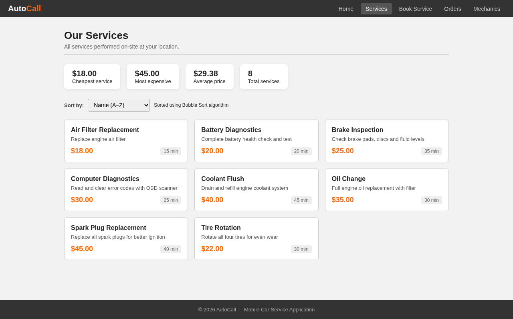
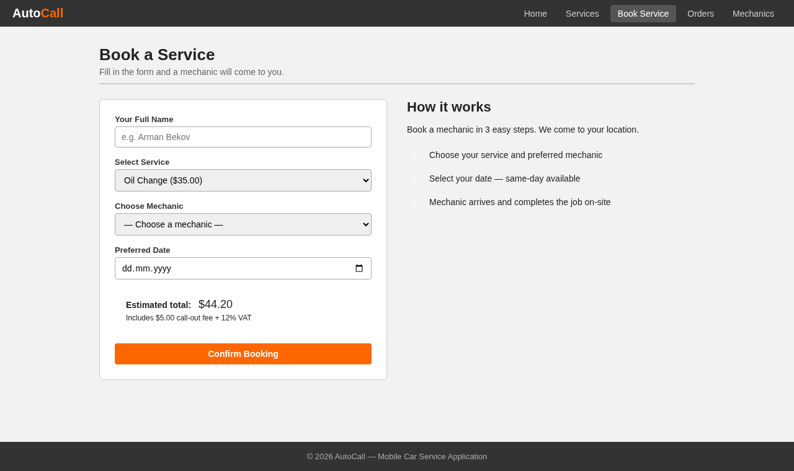
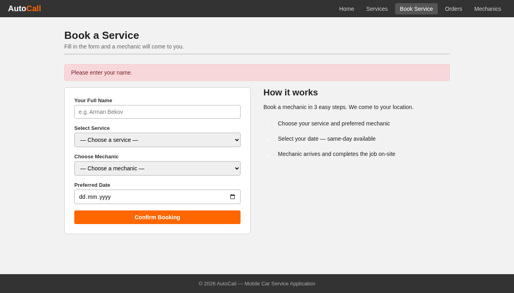
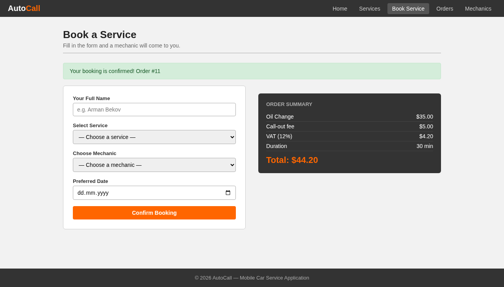
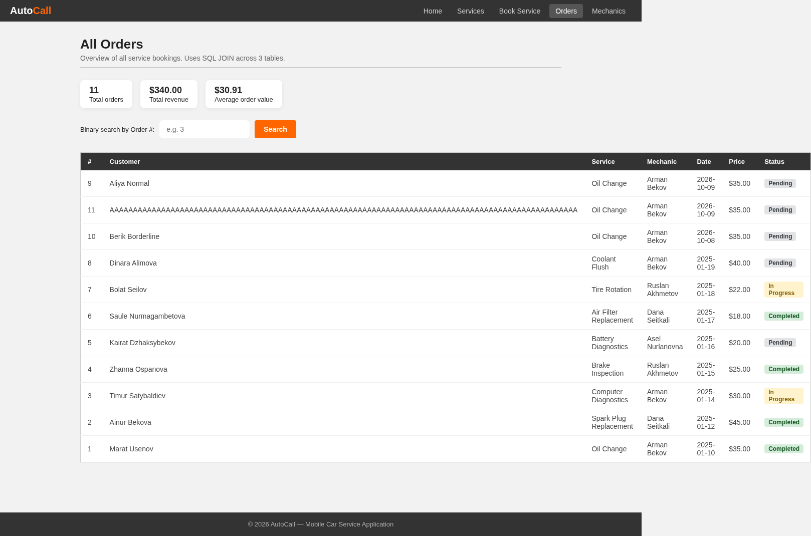
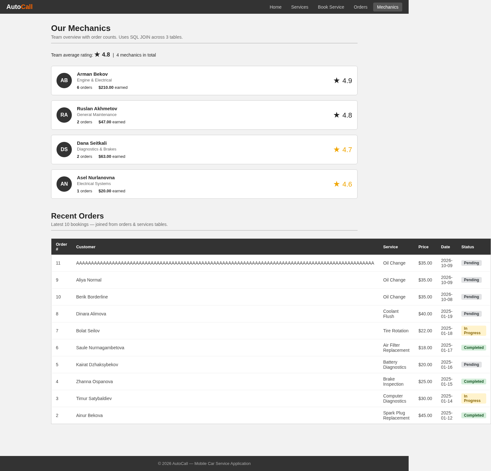

# AutoCall: разбор всех тестов (шпаргалка для защиты)

Этот документ объясняет каждый из 15 тестов проекта AutoCall: что проверяется, как, какие данные, что получили и почему. Если на защите спросят «что здесь происходит», ответ найдётся здесь.

Итог: **12 тестов PASS, 3 теста FAIL** (тесты 10, 11, 13). Все три FAIL показывают реальные ошибки в коде приложения.

## 1. Что тестируем

AutoCall: сайт для заказа выездного ремонта машины на PHP и MySQL. Пять страниц:

| Страница | Что делает |
|---|---|
| `index.php` | Главная: сколько услуг, механиков и выполненных заказов |
| `services.php` | Список услуг, сортировка (пузырьком) по названию, цене, времени; минимальная, максимальная и средняя цена |
| `order.php` | Форма заказа: имя, услуга, механик, дата. Считает цену |
| `orders.php` | Все заказы, суммы, поиск заказа по номеру (бинарный поиск) |
| `mechanics.php` | Механики: сколько заказов, сколько заработали, рейтинг |

**Как считается цена заказа** (`order.php`, строки 57–78):

- цена услуги + выезд 5,00 $ + НДС 12% от цены услуги;
- если дата заказа сегодня, ещё +20% от цены услуги (срочность).

Пример: Oil Change стоит 35,00 $. НДС = 35 × 0,12 = 4,20 $. Итого 35 + 5 + 4,20 = **44,20 $**. Если заказ на сегодня: +35 × 0,20 = 7,00 $, итого **51,20 $**.

**База данных** `car_service_db`: три таблицы (`services`, `mechanics`, `orders`) и тестовые данные: 8 услуг (от 18 до 45 $, сумма 235 $), 4 механика, 8 заказов (4 из них Completed).

## 2. Теория, которую нужно знать

### Типы тестовых данных (из конспекта курса)

| Тип | Что это | Что должна сделать программа | Пример в нашем проекте |
|---|---|---|---|
| **Нормальные** (normal) | Данные, которые обычно вводят | Работает без ошибок | Имя `Aliya Normal`, дата завтра |
| **Граничные** (borderline, extreme) | Самое крайнее значение, которое программа ещё **принимает** | Тоже работает без ошибок | Дата «сегодня» (самая ранняя разрешённая), имя из 100 символов (максимум базы) |
| **Недопустимые** (invalid) | Данные, которые программа должна **отклонить** | Показать сообщение об ошибке, не упасть | Дата «вчера», имя из пробелов, имя из 101 символа |

Главное отличие: граничное значение **принимается**, недопустимое **отклоняется**. Значение на один шаг за границей (101 символ при максимуме 100) уже недопустимое.

### Стратегия «чёрный ящик» (black box)

Тестировщик не смотрит в код. Он вводит данные на странице и сравнивает то, что видит, с ожидаемым результатом. Плюс: можно тестировать, не зная код. Минус: если тест провалился, непонятно, **почему**. Все 15 наших тестов чёрный ящик. Код я читал отдельно, чтобы объяснить причины ошибок (раздел 5).

«Белый ящик» (white box) смотрит внутрь кода, проходит по каждой ветке, использует трассировочную таблицу. Здесь не применялся.

### Как читать PASS и FAIL

- **PASS**: фактический результат совпал с ожидаемым.
- **FAIL**: не совпал. Это находка: ошибка в приложении.

## 3. Как проводились тесты

- Сервер: встроенный сервер PHP (`php -S localhost:8081`), база MySQL, браузер Chromium.
- Playwright (инструмент автоматизации браузера) сам открывал страницы, вводил данные, нажимал кнопки и делал скриншоты. Файл с тестами: `playwright/tests/carservice.spec.ts`.
- Перед запуском база загружалась заново из `database.sql`, чтобы результат не зависел от прошлых запусков.
- Тесты идут **по порядку**: тесты 5, 6, 9 создают заказы №9–№11, а тесты 12 и 15 проверяют эти заказы.
- Скриншоты лежат в папке `evidence/`.

**Почему в отчёте Playwright «15 passed», хотя 3 теста FAIL?** Тесты 10, 11, 13 помечены `test.fail`: это значит «мы знаем, что приложение здесь ошибается; тест считается успешным, пока ошибка повторяется». В отчёте Playwright это зелёная галочка. В нашей таблице результатов эти три теста честно записаны как FAIL.

**Почему в тесте 7 браузерную проверку отключали?** Поле даты имеет `min=сегодня`, и браузер сам не даёт отправить вчерашнюю дату. Нам нужно проверить ещё и сервер. Скрипт ставит форме `noValidate`, браузер перестаёт проверять, форма уходит на сервер. Код приложения при этом не менялся.

## 4. Разбор тестов

### Тест 1. Главная страница: статистика (нормальные данные)

- **Что проверяем:** главная страница правильно считает услуги, механиков и выполненные заказы.
- **Шаги:** открыть `/index.php`, прочитать три карточки.
- **Данные:** тестовые данные базы: 8 услуг, 4 механика, 4 заказа со статусом Completed (заказы №1, 2, 4, 6).
- **Ожидали:** «8 Services Available», «4 Expert Mechanics», «4+ Jobs Completed».
- **Получили:** ровно это. **PASS.**
- **Что происходит в коде:** `index.php` (строки 13–25) делает три запроса `SELECT COUNT(*)`. Третий считает только строки со статусом `Completed`. Знак «+» в «4+» просто дописан в HTML.
- **Скриншот:** `evidence/TC01_home_stats.png`


### Тест 2. Сортировка услуг по цене и статистика цен (нормальные данные)

- **Что проверяем:** сортировка по цене работает, а минимальная, максимальная и средняя цена посчитаны верно.
- **Шаги:** открыть `/services.php`, выбрать «Price (Low–High)», прочитать порядок карточек и четыре блока статистики.
- **Данные:** параметр `sort=price`; цены в базе: 18, 20, 22, 25, 30, 35, 40, 45.
- **Ожидали:** карточки от 18,00 $ до 45,00 $; минимум 18,00 $, максимум 45,00 $, среднее 29,38 $, всего 8.
- **Получили:** ровно это. Адрес изменился на `services.php?sort=price`. **PASS.**
- **Откуда 29,38:** сумма цен 235, делим на 8 = 29,375. Функция `number_format` округляет до двух знаков: 29,38.
- **Что происходит в коде:** `services.php`, строки 26–49: сортировка пузырьком. Два цикла, соседние элементы меняются местами, если левый больше правого. Строки 52–62: сумма, `min()`, `max()`, среднее.
- **Скриншот:** `evidence/TC02_services_by_price.png`


### Тест 3. Неизвестное значение сортировки (недопустимые данные)

- **Что проверяем:** если в адресе подставить мусор вместо `name`, `price` или `duration`, страница не ломается.
- **Шаги:** в адресной строке ввести `/services.php?sort=abc`.
- **Данные:** `sort=abc`: такого варианта сортировки нет.
- **Ожидали:** страница открывается без ошибки и сортирует по названию (A–Z).
- **Получили:** ровно это. **PASS.**
- **Что происходит в коде:** в сортировке (`services.php`, строки 30–40) стоят ветки `price`, `duration` и `else`. Всё неизвестное попадает в `else`, то есть сортировка по названию. Ошибки нет, потому что значение никогда не попадает в SQL.
- **Скриншот:** `evidence/TC03_sort_invalid.png`



### Тест 4. Живой расчёт цены в форме заказа (нормальные данные)

- **Что проверяем:** когда выбираешь услугу, под формой появляется ориентировочная сумма.
- **Шаги:** открыть `/order.php`, выбрать «Oil Change ($35.00)», посмотреть блок «Estimated total».
- **Данные:** Oil Change, 35,00 $. Ожидаемая сумма: 35 + 5 + 4,20 = 44,20 $.
- **Ожидали:** блок появляется и показывает 44,20 $.
- **Получили:** блок появился, «$44.20» и подпись «Includes $5.00 call-out fee + 12% VAT». **PASS.**
- **Что происходит в коде:** JavaScript-функция `updatePrice` (`order.php`, строки 272–287) берёт цену из атрибута `data-price` выбранной услуги и считает `цена + 5 + цена × 0,12`.
- **Важно знать:** предварительный расчёт **не учитывает** надбавку 20% за заказ на сегодня. Если выбрать сегодняшнюю дату, предварительно будет 44,20 $, а итог после заказа 51,20 $. Это мелкая неточность, тестами она не проверялась, но если спросят, можно упомянуть.
- **Скриншот:** `evidence/TC04_live_estimate.png`



### Тест 5. Заказ на завтра (нормальные данные)

- **Что проверяем:** обычный заказ сохраняется, цена считается верно.
- **Шаги:** открыть `/order.php`, ввести имя `Aliya Normal`, услуга Oil Change, механик Arman Bekov, дата завтра (`2026-10-09`), нажать «Confirm Booking».
- **Ожидали:** сообщение «Your booking is confirmed! Order #9» и справа «Order Summary» с итогом 44,20 $.
- **Получили:** ровно это: Oil Change 35,00; выезд 5,00; НДС 4,20; длительность 30 мин; Total 44,20. **PASS.**
- **Почему номер 9:** в базе уже 8 заказов, следующий номер даёт `AUTO_INCREMENT`.
- **Что происходит в коде:** `order.php`: проверки полей (строки 38–49), цена из базы (строка 52), расчёт (57–61), `INSERT` (81–84), сообщение с номером заказа (строка 85).
- **Скриншот:** `evidence/TC05_booking_tomorrow.png`


### Тест 6. Заказ на сегодня (граничные данные)

- **Что проверяем:** самая ранняя разрешённая дата (сегодня) принимается и даёт надбавку 20%.
- **Шаги:** то же, что в тесте 5, но имя `Berik Borderline`, дата сегодня (`2026-10-08`).
- **Почему это граничное значение:** программа отклоняет даты раньше сегодняшней, значит «сегодня» самое крайнее значение, которое она ещё принимает.
- **Ожидали:** заказ принят, в сводке строка «Same-day surcharge (20%) +$7.00», итог 51,20 $.
- **Получили:** «Order #10», надбавка +7,00 $, Total 51,20 $. **PASS.**
- **Что происходит в коде:** `order.php`, строки 68–71: если `$order_date === $today`, то `urgency_charge = цена × 0,20`. 35 × 0,20 = 7,00. Итог: 35 + 5 + 4,20 + 7 = 51,20.
- **Скриншот:** `evidence/TC06_booking_today.png`


### Тест 7. Заказ на вчера (недопустимые данные)

- **Что проверяем:** дата в прошлом отклоняется, причём и браузером, и сервером.
- **Шаги:** открыть форму, имя `Ivan Invalid`, Oil Change, Arman Bekov, дата вчера (`2026-10-07`), нажать «Confirm Booking». Браузер остановил форму. Затем скрипт отключил проверку браузера и форма ушла на сервер.
- **Ожидали:** сообщение «Please select a future date.», заказ не сохранён.
- **Получили:**
  1. Браузер показал подсказку «Value must be 08.10.2026 or later.» (скриншот `TC07_client_validation.png`);
  2. сервер показал «Please select a future date.», сводки заказа нет, заказ не сохранён. **PASS.**
- **Что происходит в коде:** два слоя защиты. Первый: в HTML у поля даты стоит `min="сегодня"` (`order.php`, строка 198). Второй: сервер, строки 72–75: `elseif ($order_date < $today)` ставит ошибку.
- **Зачем два слоя:** защита только в браузере ненадёжна, запрос можно отправить и без браузера. Сервер обязан проверять сам.
- **Скриншоты:** `evidence/TC07_client_validation.png`, `evidence/TC07_past_date_rejected.png`


### Тест 8. Имя из одних пробелов (недопустимые данные)

- **Что проверяем:** пустое имя не принимается, даже если выглядит «непустым».
- **Шаги:** в поле имени ввести 5 пробелов, выбрать услугу, механика, завтрашнюю дату, нажать «Confirm Booking».
- **Ожидали:** «Please enter your name.», заказ не сохранён.
- **Получили:** ровно это. **PASS.**
- **Что происходит в коде:** у поля стоит `required`, но браузер считает 5 пробелов заполненным полем и пропускает. Сервер делает `trim()` (`order.php`, строка 32), пробелы исчезают, остаётся пустая строка, и `empty()` (строка 38) даёт ошибку.
- **Побочное наблюдение:** `empty("0")` в PHP тоже истина, поэтому имя `0` сервер отклонил бы так же. Тестами не проверялось.
- **Скриншот:** `evidence/TC08_blank_name.png`



### Тест 9. Имя из 100 символов (граничные данные)

- **Что проверяем:** самое длинное имя, которое помещается в базу, принимается.
- **Шаги:** имя из 100 букв `A`, Oil Change, Arman Bekov, завтра, «Confirm Booking».
- **Почему 100:** колонка `customer_name` объявлена как `VARCHAR(100)` (`database.sql`). 100 символов это максимум.
- **Ожидали:** заказ принят, итог 44,20 $.
- **Получили:** «Your booking is confirmed! Order #11», Total 44,20 $. На странице заказов видно полное имя. **PASS.**
- **Заметка:** длинное имя растягивает таблицы заказов и механиков шире страницы (мелкий дефект вёрстки, см. раздел 5).
- **Скриншот:** `evidence/TC09_name_100.png`



### Тест 10. Имя из 101 символа (недопустимые данные), FAIL

- **Что проверяем:** слишком длинное имя отклоняется с понятным сообщением.
- **Шаги:** имя из 101 буквы `B`, Oil Change, Arman Bekov, завтра, «Confirm Booking».
- **Ожидали:** сообщение об ошибке на странице заказа, заказ не сохранён.
- **Получили:** пустая белая страница, сервер ответил кодом 500, никакого сообщения. В логе сервера: «Data too long for column 'customer_name'». Заказ не сохранился (на странице заказов осталось 11 заказов). **FAIL.**
- **Что происходит в коде:** `order.php` вообще не проверяет длину имени (строки 38–49 проверяют только «не пусто»). База (в строгом режиме) отказывается вставить 101 символ в `VARCHAR(100)`. Современный PHP при ошибке запроса выбрасывает исключение. Его никто не ловит, страница обрывается. Поскольку `display_errors` выключен, пользователь видит пустую страницу.
- **Как исправить:** проверить `strlen($customer_name) > 100` до вставки и показать сообщение; добавить `maxlength="100"` в поле.
- **Скриншот:** `evidence/TC10_name_101.png` (белая страница; это и есть доказательство сбоя)


### Тест 11. Имя с апострофом (нормальные данные), FAIL

- **Что проверяем:** обычная фамилия с апострофом, `Dana O'Connor`, сохраняется как любое другое имя.
- **Шаги:** имя `Dana O'Connor`, Oil Change, Arman Bekov, завтра, «Confirm Booking».
- **Ожидали:** «Your booking is confirmed!», итог 44,20 $.
- **Получили:** пустая белая страница, код 500. В логе: «You have an error in your SQL syntax … near 'Connor'». Заказ не сохранён. **FAIL.**
- **Что происходит в коде** (`order.php`, строки 81–82):

```php
$insert_query = "INSERT INTO orders (...)
    VALUES ('$customer_name', $service_id, ...)";
```

Имя вставляется прямо в текст SQL-запроса. С именем `Dana O'Connor` запрос превращается в `VALUES ('Dana O'Connor', ...)`: апостроф закрывает строку раньше времени, остаток `Connor'...` ломает запрос.

- **Почему это ещё и безопасность (SQL-инъекция):** тот же механизм позволяет злоумышленнику вписать в поле имени свою SQL-команду и выполнить её в базе. Поэтому ошибка высокой важности.
- **Как исправить:** подготовленный запрос (prepared statement):

```php
$stmt = mysqli_prepare($connection,
  "INSERT INTO orders (customer_name, service_id, mechanic_id, order_date, status)
   VALUES (?, ?, ?, ?, 'Pending')");
mysqli_stmt_bind_param($stmt, 'siis', $customer_name, $service_id, $mechanic_id, $order_date);
mysqli_stmt_execute($stmt);
```

- **Скриншот:** `evidence/TC11_name_apostrophe.png` (белая страница)


### Тест 12. Страница заказов: список и суммы (нормальные данные)

- **Что проверяем:** страница показывает все заказы с названием услуги и именем механика, считает общее количество, выручку и средний чек.
- **Шаги:** открыть `/orders.php`, прочитать три блока сверху и таблицу.
- **Данные:** 8 исходных заказов (235,00 $) и 3 новых заказа Oil Change из тестов 5, 6, 9 (3 × 35 = 105 $).
- **Ожидали:** 11 заказов, выручка 340,00 $, средний чек 30,91 $.
- **Получили:** ровно это. В таблице 11 строк, новые даты сверху. **PASS.**
- **Откуда числа:** 235 + 105 = 340. 340 / 11 = 30,909…, округление даёт 30,91.
- **Что происходит в коде:** `orders.php`, строки 11–25: запрос `JOIN` трёх таблиц (`orders`, `services`, `mechanics`) с сортировкой по дате по убыванию. Строки 75–79: сумма и среднее.
- **Почему 11, а не 13:** тесты 10 и 11 заказ не сохранили.
- **Скриншот:** `evidence/TC12_orders_list.png`



### Тест 13. Поиск заказа №1 (граничные данные), FAIL

- **Что проверяем:** поиск находит заказ с самым маленьким номером.
- **Шаги:** на `/orders.php` ввести `1` в поле «Binary search by Order #», нажать «Search».
- **Почему это граничное значение:** №1 самый маленький существующий номер, и поле принимает значения от 1 (`min="1"`).
- **Ожидали:** карточка «Order #1 found» с Marat Usenov, Oil Change, Arman Bekov.
- **Получили:** «Order #1 not found.», хотя заказ №1 виден в таблице ниже. **FAIL.**
- **Что происходит в коде** (`orders.php`, строка 63):

```php
if ($sorted[$mid]['order_id'] === $search_id) {
```

`$search_id` это число (строка 37 приводит его через `(int)`). А `order_id`, пришедший из базы через `mysqli_fetch_assoc`, это **строка** `"1"`. Оператор `===` сравнивает ещё и тип, поэтому `"1" === 1` ложь. Ни один заказ никогда не найдётся.

- **Что такое бинарный поиск:** массив сортируется, берётся середина; если искомое меньше, ищем в левой половине, иначе в правой. Алгоритм в коде записан правильно (строки 57–71), ломает его только сравнение типов.
- **Как исправить:** `(int)$sorted[$mid]['order_id'] === $search_id` или заменить `===` на `==`.
- **Скриншот:** `evidence/TC13_search_order1.png`


### Тест 14. Поиск несуществующего заказа (недопустимые данные)

- **Что проверяем:** если заказа нет, показывается понятное сообщение, а таблица остаётся.
- **Шаги:** ввести `999`, нажать «Search».
- **Ожидали:** «Order #999 not found.»
- **Получили:** ровно это, над полной таблицей. **PASS.**
- **Важно:** этот тест проходит, но по неверной причине. Из-за ошибки в тесте 13 поиск не находит ничего, поэтому «not found» он покажет для любого номера. Если на защите спросят, почему тест 14 PASS, а 13 FAIL, ответ такой: тест 14 проверяет только сообщение «не найден», и оно показывается правильно. Тест 13 проверяет, что существующий заказ **находится**, и вот это не работает.
- **Скриншот:** `evidence/TC14_search_order999.png`


### Тест 15. Страница механиков (нормальные данные)

- **Что проверяем:** число заказов и заработок каждого механика, средний рейтинг команды.
- **Шаги:** открыть `/mechanics.php`.
- **Данные:** рейтинги 4,9; 4,8; 4,7; 4,6. У Arman Bekov 3 исходных заказа (35 + 30 + 40 = 105 $) и 3 новых по 35 $ (ещё 105 $).
- **Ожидали:** «Team average rating 4.8», 4 механика, у Arman Bekov 6 заказов и 210,00 $.
- **Получили:** Arman Bekov 6 заказов, 210,00 $; Ruslan Akhmetov 2, 47,00 $; Dana Seitkali 2, 63,00 $; Asel Nurlanovna 1, 20,00 $. Средний рейтинг 4,8. **PASS.**
- **Откуда 4,8:** (4,9 + 4,8 + 4,7 + 4,6) / 4 = 4,75, округление до одного знака даёт 4,8.
- **Что происходит в коде:** `mechanics.php`, строки 11–24: `LEFT JOIN` механиков с заказами и услугами, `COUNT` и `SUM` с группировкой по механику. `LEFT JOIN` нужен, чтобы механик без заказов тоже попал в список.
- **Мелочь:** у Asel Nurlanovna написано «1 orders» (нет склонения). Это косметика.
- **Скриншот:** `evidence/TC15_mechanics.png`



## 5. Найденные ошибки (коротко)

| Тест | Важность | Что не так | Где | Как исправить |
|---:|---|---|---|---|
| 11 | Высокая | Имя с апострофом ломает запрос; та же дыра позволяет SQL-инъекцию | `order.php`, строки 81–84 | Подготовленный запрос |
| 13 | Высокая | Поиск никогда не находит заказ: строка сравнивается с числом через `===` | `orders.php`, строка 63 | Привести к `(int)` |
| 10 | Средняя | Имя длиннее 100 символов роняет страницу вместо сообщения | `order.php`, строки 38–49, 84 | Проверить длину, добавить `maxlength` |
| нет | Средняя | При ошибке сохранения пользователю показывается текст ошибки базы («Error saving order: …»). Это раскрывает структуру таблиц | `order.php`, строка 101 | Общее сообщение, подробности в лог |
| 12 | Низкая | Длинное имя растягивает таблицы шире страницы | `css/style.css` | Разрешить перенос слов |

Про ошибку из строки 101: в нашей среде PHP падает раньше (тесты 10 и 11), но если исключения mysqli отключены (старый PHP или другие настройки), этот код выведет пользователю текст ошибки базы вместе с куском запроса. На другом сервере, где включён `display_errors`, пользователь увидит даже трассировку стека.

## 6. Вопросы, которые могут задать, и ответы

**Что такое тестовые данные и какие они бывают?**
Это значения, которые вводят в программу при тесте. Три типа: нормальные (обычные), граничные (самое крайнее значение, которое ещё принимается), недопустимые (то, что нужно отклонить).

**Чем граничные данные отличаются от недопустимых?**
Граничные принимаются и обрабатываются как нормальные. Недопустимые отклоняются с ошибкой. Пример: максимум имени 100 символов. 100 граничное (принято, тест 9), 101 недопустимое (должно быть отклонено, тест 10).

**Почему вы называете «сегодня» граничной датой?**
Программа принимает даты начиная с сегодняшней. Это самая ранняя принимаемая дата, значит край диапазона. «Вчера» уже за границей, и это недопустимые данные.

**Что значит «чёрный ящик»?**
Тестируем только через интерфейс: ввели данные, посмотрели, что получилось. Код во время теста не смотрим. Поэтому при FAIL мы знаем, **что** не работает, но причину ищем отдельно в коде.

**Чем отличается «чёрный ящик» от «белого»?**
Белый ящик проверяет внутренности: проходит по каждой ветке алгоритма, часто с трассировочной таблицей. Плюс: сразу видно место ошибки. Минус: долго.

**Зачем нужен план тестирования?**
Это документ: что тестируем, зачем, какие данные, что ожидаем. Фактический результат и доказательства (скриншоты) дописываются после теста. Наша таблица результатов это и есть заполненный план.

**Зачем два слоя проверки в тесте 7?**
Браузерная проверка удобна пользователю, но обходится (запрос можно отправить напрямую). Сервер обязан проверять сам. Тест сначала показывает браузерный слой, потом, с отключённой проверкой браузера, серверный.

**Что такое SQL-инъекция? Покажите на нашем примере.**
Когда данные пользователя вставляются в текст SQL-запроса без экранирования, пользователь может изменить сам запрос. В `order.php` имя вставляется прямо в `INSERT`. Апостроф в имени (тест 11) ломает запрос. Злоумышленник может так же дописать свои команды. Защита: подготовленные запросы.

**Почему вы не исправили ошибки в коде?**
Задача тестировщика найти и описать ошибки, а не править приложение. В отчёте для каждой ошибки указаны место в коде и способ исправления.

**Почему «15 passed» в Playwright, а в отчёте 3 FAIL?**
Тесты 10, 11, 13 помечены `test.fail`: Playwright считает их успешными, пока приложение действительно ошибается. Для отчёта это FAIL. Так тест-ран завершается и делает скриншоты, а ошибки остаются задокументированными.

**Почему тест 14 PASS, если поиск вообще не работает?**
Тест 14 проверяет только сообщение «Order #999 not found.» для несуществующего номера. Оно показывается правильно. Отсутствие сбоя в этом тесте не доказывает, что поиск рабочий; рабочий ли поиск, проверяет тест 13.

**Почему результат зависит от порядка тестов?**
Тесты 5, 6, 9 создают заказы, а тесты 12 и 15 проверяют итоги по ним. Поэтому порядок фиксированный, а перед запуском база загружается заново.

**Какие доказательства у каждого теста?**
Скриншот в папке `evidence/`: имя файла начинается с номера теста. В тестах 10 и 11 скриншот это белая страница (это и есть результат сбоя), поэтому в таблице дополнительно приведена строка из лога сервера.

**Какая самая серьёзная находка?**
Тест 11: SQL-инъекция в форме заказа. Любой посетитель сайта может отправить свои SQL-команды через поле «Имя».
